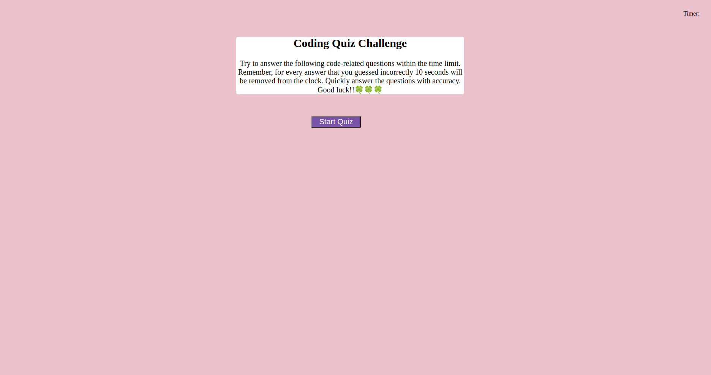

# timedQuizJS
The purpose of this assignment is to create a quiz, where the user is rewarded 10 points for answering the question correctly  and penalizes -10 seconds from the clock ifor answering the question incorrectly.

## Website Screenshot
This is what the quiz looks like when the user loads the quiz to the browser.

## How Code Was Refractored
* Adding and calling functions to help perform a certain task.
* Creating speific variables to serve different purpose.
* Creating a js file that makes the html more dynamic
* Adding CSS to html to style it

## How to deploy the link application
* Click on this link for deployed application
* https://github.com/mstan19/timedQuizJS

